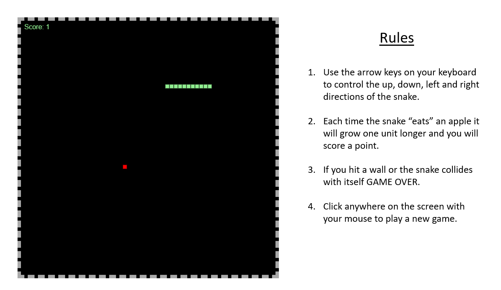

# JavaScript Snake GAme
 
 ###  My own rendition of the classic snake game from the days of the flip phone.
 
#### Play it [here](https://trevorton27.github.io/Application-1SnakeGame/)
 
 
 
## Summary
This was my first experience working with JS Canvas and implementing JavaScript language to build a game. It was definitely challenging but a lot of fun in the end. This app really helped me to understand just how many ways there are to use code in the real world.

## Author
Trevor Mearns - Full Stack Software Developer [LinkedIn](https://www.linkedin.com/in/trevor-mearns-8a042a56/) | [Personal Website](https://trevormearns.com/)

